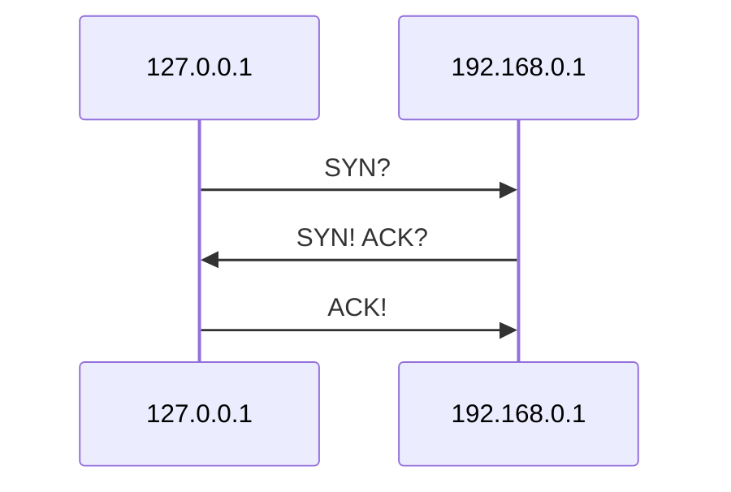
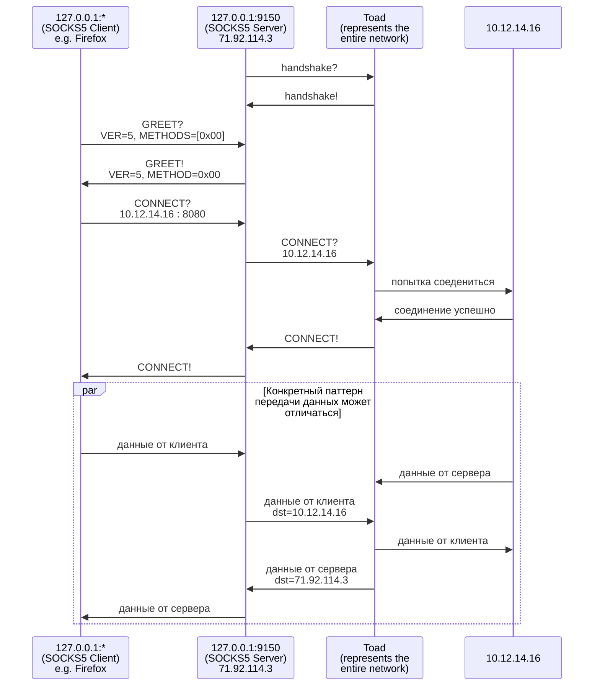

# Путь Пакета

Этот документ описывает полный путь пакета на нескольких уровнях абстракции. Заранее ознакомьтесь с [глоссарием](./../glossary.md). 

Текст формата `X?` означает запрос, а `X!` означает ответ. 
Пример использования:

Ниже показана неполная диаграмма взаимодействия. На ней скрыти детали направления конкретных пакетов. Toad представляет из себя _всю_ сеть.

